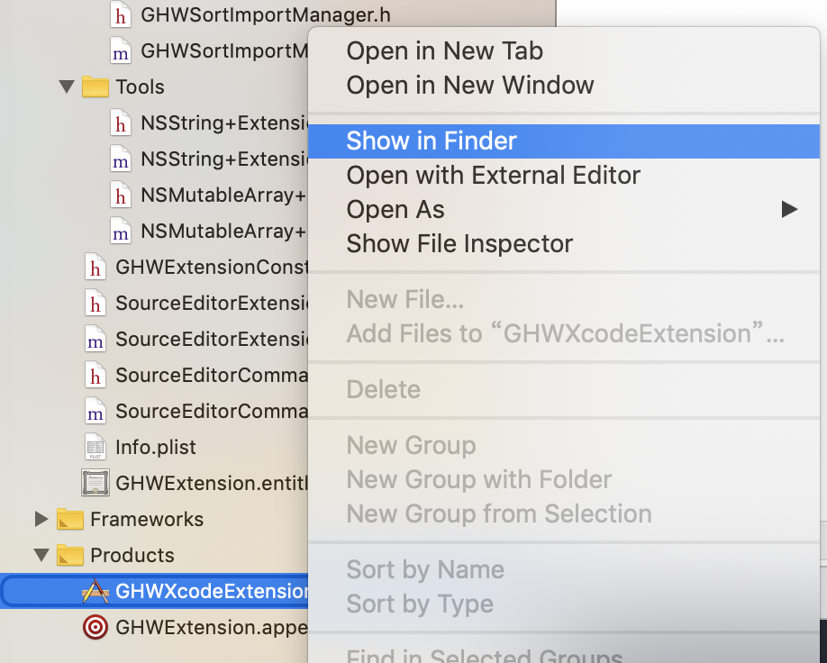
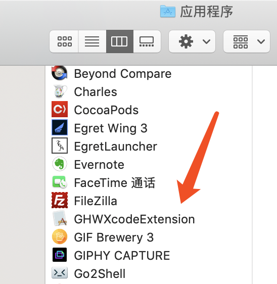
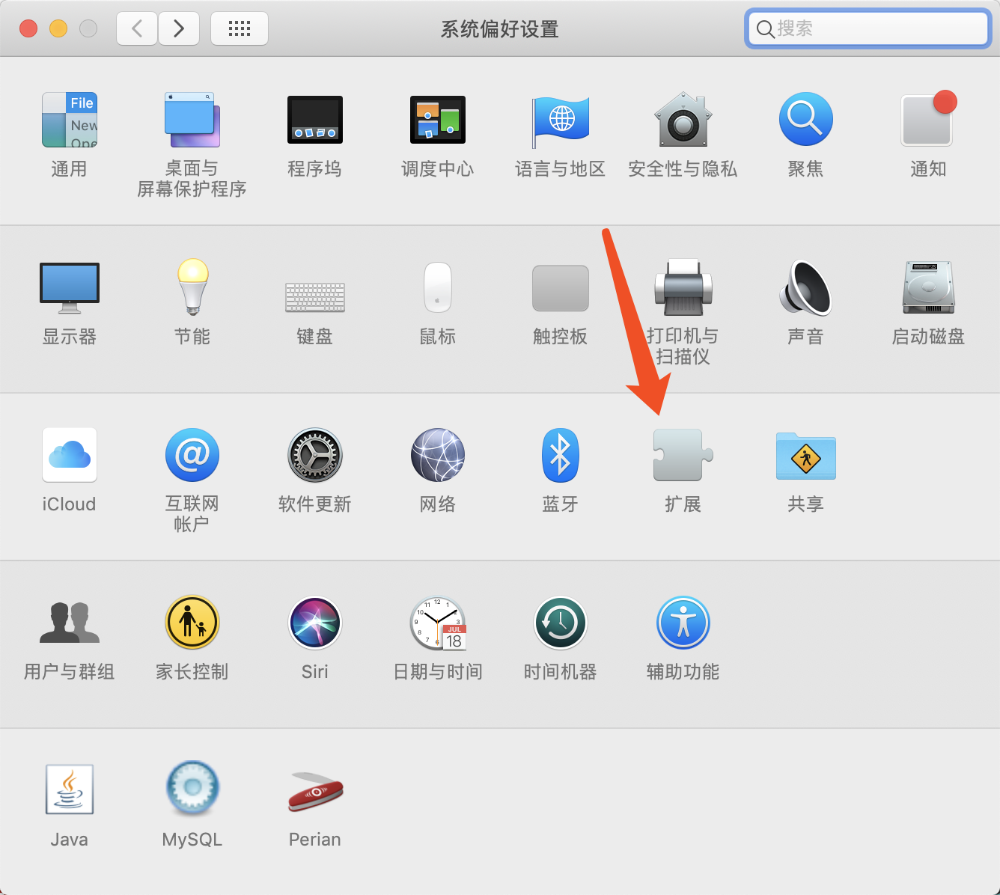
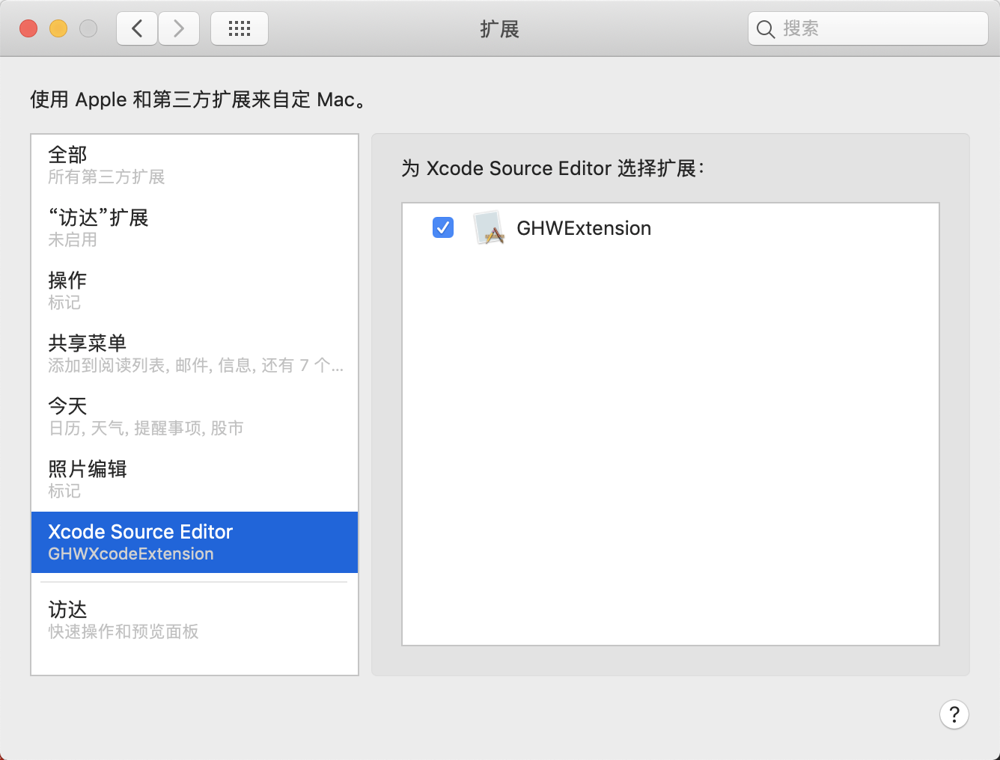
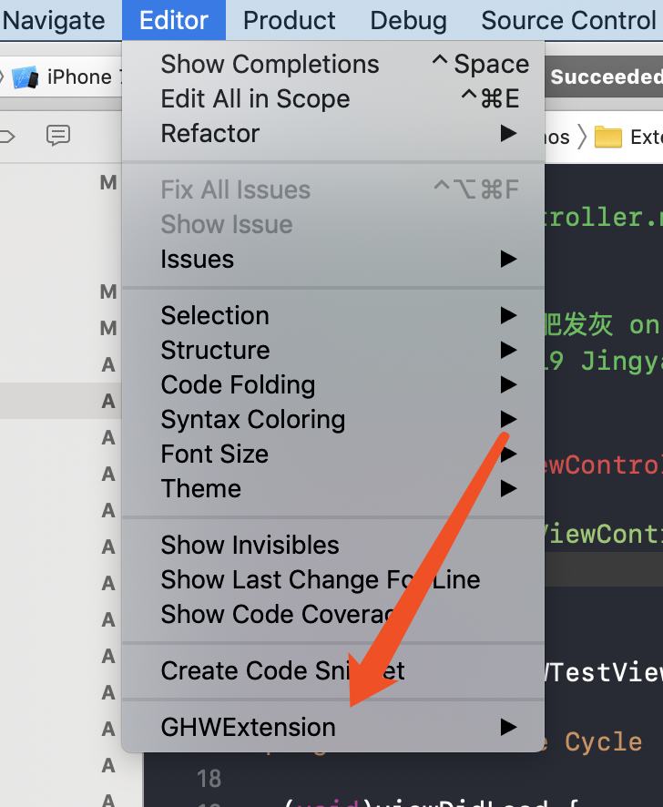
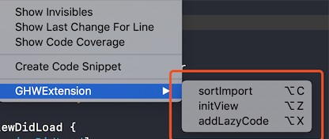
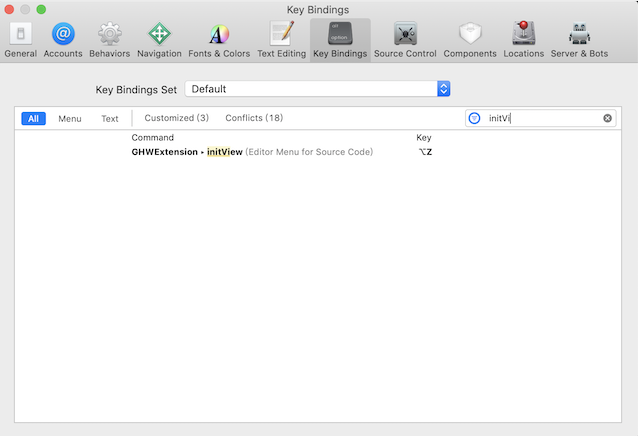
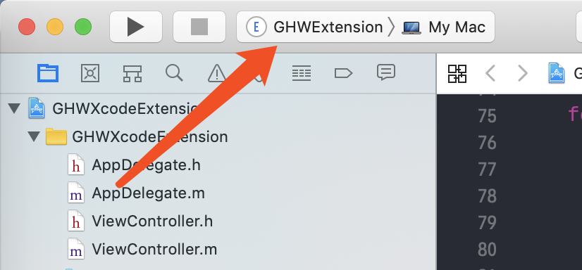
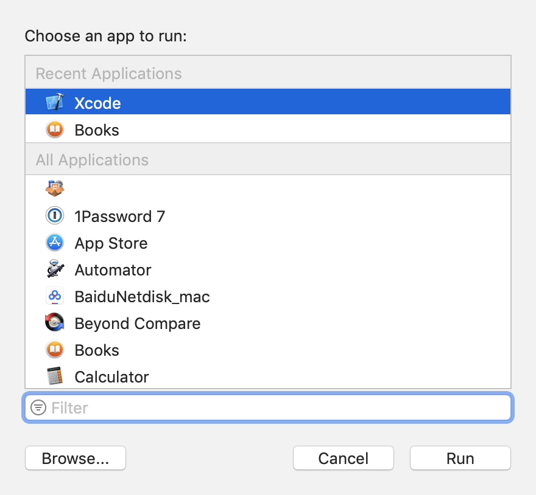
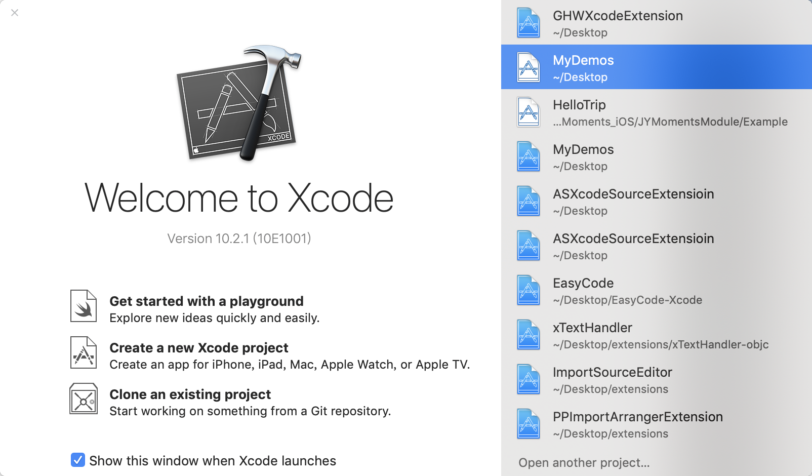

# GHWXcodeExtension
### 目录
[一. 实现的功能](https://github.com/guohongwei719/GHWXcodeExtension#%E4%B8%80-%E5%AE%9E%E7%8E%B0%E7%9A%84%E5%8A%9F%E8%83%BD)  
[二. 使用方法](https://github.com/guohongwei719/GHWXcodeExtension#%E4%BA%8C-%E4%BD%BF%E7%94%A8%E6%96%B9%E6%B3%95)  
[三. 使用注意事项](https://github.com/guohongwei719/GHWXcodeExtension#%E4%B8%89-%E4%BD%BF%E7%94%A8%E6%B3%A8%E6%84%8F%E4%BA%8B%E9%A1%B9)  
[四. 调试 GHWXcodeExtension](https://github.com/guohongwei719/GHWXcodeExtension#%E5%9B%9B-%E8%B0%83%E8%AF%95-ghwxcodeextension)  
[五. 后记](https://github.com/guohongwei719/GHWXcodeExtension#%E4%BA%94-%E5%90%8E%E8%AE%B0)

## 一. 实现的功能
#### 1. 初始化view、viewController，自动删除无用代码和添加默认代码；

#### 2. 为属性自动添加懒加载代码、对应协议声明和协议方法，主要有 UITableView\UICollectionView\UIScrollView；  

#### 3. 给 import 分组排序，从上到下为 viewController、view、manager & logic、第三方库、model、category、其他。
  

## 二. 使用方法
#### 1. 将项目 clone 下来
#### 2. 编译成功，到 Products 下，选择 GHWXcodeExtension.app 右键，选择 Show in Finder

#### 3. 将 GHWXcodeExtension 复制到应用程序下面，双击打开

#### 4. 到 系统偏好设置 找到 扩展，选择 Xcode Source Editor，选中 GHWExtension

#### 5. 打开项目以后，可以在 Xcode 菜单栏，选择 Editor, 可以看到 GHWExtension 出现在最下面

#### 6. 选择 GHWExtension，出现可以使用的功能选项，顾名思义

#### 7. 三个功能选项都可以配置快捷键，推荐分别设置为 option+z\option+x\option+c，如下图

## 三. 使用注意事项
#### 1. 使用 addLazyCode 功能的时候，如果添加了代码后想撤销，使用 command + z，这时候 Xcode 可能会 crash，这应该是 Xcode 本身的一个 bug，所以需要注意一下，正常情况下添加以后也不会撤销，如果要撤销手动删除也很方便，即使 crash 了再打开就行了，打开以后是删除状态。希望苹果能尽快修复这个 bug。

## 四. 调试 GHWXcodeExtension
#### 1. 选择 GHWExtension scheme

#### 2. 运行，选择 xcode，点击 run

#### 3. 选择一个项目

## 五. 后记
欢迎提 bug 和 feature。  
微博：[黑化肥发灰11](https://weibo.com/u/2977255324)   
简书地址：[https://www.jianshu.com/u/fb5591dbd1bf](https://www.jianshu.com/u/fb5591dbd1bf)